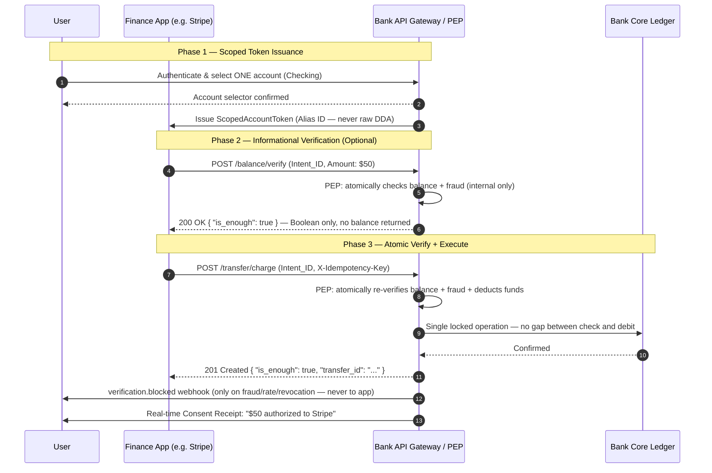

# Least Data Banking Protocol (LDBP)

**A Bank-Side Open Standard for Privacy-by-Design Banking**

> *Implemented once by any bank. Used by any Finance App. No app-side protocol changes required.*

> *Replacing "All-Access" data extraction with Boolean verification — the "is_enough" check.*

**Author:** Mary Ann Belarmino — [BelarminoAdvisory.com](https://belarminoadvisory.com)  
**Version:** 1.0 — April 2026  
**License:** [CC BY 4.0](https://creativecommons.org/licenses/by/4.0/) — Attribution required on all uses and implementations  
**Status:** Active — Open for implementation feedback and technical contributions

---

## The Problem

Every time a user links a bank account to a payment app — Stripe, Venmo, Cash App, Klarna — they may unknowingly provide persistent access to their accounts, transaction history, and balances far beyond what any single transaction requires. In 2022, Plaid — the aggregator powering bank account linking for Venmo, Stripe, and Cash App — settled a $58 million class action lawsuit for collecting and profiting from user financial data without meaningful consent.

To verify a single $50 transaction, the app receives everything.

> **Note on aggregator-layer approaches:** Products like Plaid Signal improve ACH risk intelligence on top of the all-access model — but [the raw balance still leaves the bank](https://plaid.com/docs/api/products/transactions/), and up to 24 months of transaction history is still accessed. LDBP eliminates the all-access model at the source. It is not a smarter layer on top of data extraction; it is an architectural replacement for it.

## The Solution

The Least Data Banking Protocol (LDBP) shifts the paradigm from **Data Extraction** to **Insight Verification**.

Instead of returning a raw balance of $1,402.21, the bank's Policy Enforcement Point (PEP) returns a single Boolean: *does this account hold sufficient funds for this specific transaction?* Nothing else leaves the bank.

The Finance App asks: *"Is there enough for this $50 purchase?"*  
The bank answers: *True* or *False.*

That is the entire data transfer. No balance. No history. No profile.

---

## The Five Least-Data Principles

Every LDBP-conformant implementation must satisfy these five architectural invariants. Violation of any one is **Principle Drift** — the implementation is not LDBP.

| Principle | Statement |
|---|---|
| **P1 — Data Minimization** | A Finance App must receive only what is necessary to complete the transaction and nothing more. |
| **P2 — Purpose Limitation** | Verification results must not be used for profiling, upselling, credit scoring, or any secondary purpose. |
| **P3 — Account Isolation** | A Finance App must be scoped to exactly one user-selected account. Access to any other account is architecturally impossible, not merely prohibited by policy. |
| **P4 — Notification Sovereignty** | When a verification is blocked, the bank notifies the user directly. The Finance App receives only False — with no reason code. |
| **P5 — User Control** | The user must be able to revoke a Finance App's access instantly, unilaterally, and without contacting the Finance App. |

---

## System Flow

The following diagram illustrates the LDBP transaction flow under the final protocol architecture. Note: there is no separate verify→execute step. `POST /transfer/charge` atomically re-verifies and executes in a single locked PEP operation — eliminating the race condition gap entirely.



**Key design points visible in the flow:**
- The Finance App receives only a Boolean — never a raw balance
- `POST /transfer/charge` re-verifies atomically at execution time — the Phase 2 verify result is informational only
- All notifications go bank → user directly — never bank → app → user
- The raw DDA account number never leaves the bank at any point

---

## API Surface

Full specification: [`ldbp_api.yaml`](./ldbp_api.yaml) — OpenAPI 3.0, validated

| Endpoint | Phase | Purpose |
|---|---|---|
| `POST /auth/token/exchange` | 1 | Issues ScopedAccountToken — user selects one account, bank issues Alias ID (never raw DDA) |
| `POST /auth/token/revoke` | 1 | Kill Switch — instantly terminates Finance App access |
| `POST /balance/verify` | 1 | The "is_enough" check — composite atomic Boolean: balance + fraud in one PEP operation |
| `POST /transfer/charge` | 1 | The only fund movement path — atomic verify + execute, no separate execute step |
| `GET /governance/permission-budget` | 2 | Returns remaining Virtual Allowance — threshold only, no balance returned |
| `POST /batch/balance/verify` | 2 | Batch informational verify — no funds moved, per-intent Boolean results |
| `POST /batch/transfer/charge` | 2 | Batch atomic verify + execute — partial success valid, HTTP 207 |
| `GET /billing/metering` | 2 | Real-time fee attribution for bank basis-point royalties |
| `POST /webhooks/verification.blocked` | 2 | Bank-to-user fraud block notification — never forwarded to Finance App |

**Phase 1** (required for LDBP conformance): `/auth/token/exchange`, `/auth/token/revoke`, `/balance/verify`, `/transfer/charge`  
**Phase 2** (optional governance and batch extensions): all remaining endpoints

---

## Dossier Contents

This repository is a complete Product Design Dossier. All artifacts are mutually consistent as of April 2026.

| File | What It Is | Primary Audience |
|---|---|---|
| [`LDBP_Whitepaper.pdf`](./docs/LDBP_Whitepaper.pdf) | Foundational concept document — the problem, the principles, the rationale | Executives, regulators, product leaders, journalists |
| [`ldbp_api.yaml`](./docs/ldbp_api.yaml) | OpenAPI 3.0 specification — all endpoints, schemas, behavioral contracts | Bank architects, Finance App developers |
| [`LDBP_PRD.docx`](./docs/LDBP_PRD.docx) | Product Requirements Document — functional requirements, use cases, architecture, regulatory mapping | Engineering teams, product managers, compliance officers |
| [`LDBP_CONFORMANCE.md`](./LDBP_CONFORMANCE.md) | Conformance Definition — what counts as LDBP, Principle Drift taxonomy, required attribution statement | Implementing institutions, legal and compliance teams, auditors |
| [`LDBP_Conformance.docx`](./docs/LDBP_Conformance.docx) | Formal distribution version of the Conformance Definition | Regulatory submissions, vendor contracts |
| [`LDBP_READER_GUIDE.md`](./LDBP_READER_GUIDE.md) | Navigation guide — what each artifact is and who should read it | All readers new to the dossier |

**Not sure where to start?** Read the [`LDBP_READER_GUIDE.md`](./LDBP_READER_GUIDE.md).

---

## Conformance

Any implementation claiming LDBP conformance must satisfy every requirement in the [LDBP Conformance Definition](./LDBP_CONFORMANCE.md).

Any modification that violates the five Least-Data Principles constitutes **Principle Drift** and may not be represented as LDBP, regardless of naming, marketing, or partial compliance.

LDBP is app-agnostic by design. The conformance standard applies to bank implementations. Finance Apps are consumers of the interface, not implementers of the protocol.

When claiming conformance, the implementing institution must include the following attribution in all relevant documentation, API specifications, developer portals, and regulatory filings:

> *"This implementation conforms to the Least Data Banking Protocol (LDBP) as defined by Mary Ann Belarmino (BelarminoAdvisory.com). LDBP Conformance Definition. Licensed under CC BY 4.0."*

---

## Intended Audiences

**Bank API Architects and Engineering Teams**
Review the OpenAPI spec and PRD for implementation requirements. Phase 1 is achievable in 6–9 months without core ledger replacement. The Translation and Governance Layer sits on top of your existing core (FIS, Fiserv, Jack Henry).

**Finance App Developers**
LDBP is a standard you integrate *with*, not a protocol you implement. Review the API spec for the integration contract. Any Finance App connecting to an LDBP-compliant bank automatically receives Boolean verification, scoped tokens, and notification sovereignty — regardless of app category or size. LDBP reduces your data liability, eliminates NSF race conditions, and removes the compliance surface area that comes with holding raw user financial data.

**Risk and Compliance Officers**
Review the PRD's Regulatory Compliance Mapping section for CFPB Section 1033, GDPR Purpose Limitation, PSD3, FiDA, and Regulation E alignment. Review the Conformance Definition for enforcement criteria.

**Regulators and Policy Makers**
Review the Whitepaper for the protocol's alignment with data minimization mandates. LDBP transforms "reasonably necessary" from a legal assertion into a technical guarantee — making over-collection architecturally impossible, not just contractually prohibited.

**AI and Agentic System Developers**
LDBP's scoped proof model is the correct authorization primitive for autonomous financial agents. Each intent is bounded by its declared purpose — a compromised sub-agent cannot accumulate account state beyond its scoped proof. Review the Whitepaper's Agentic Governance section and the batch endpoints in the API spec.

---

## Regulatory Alignment

| Regulation | How LDBP Addresses It |
|---|---|
| CFPB Section 1033 | Transforms "reasonably necessary" data collection from legal assertion to technical guarantee via Boolean-only responses |
| GDPR — Purpose Limitation | Finance App never possesses raw data — cannot use for secondary purposes by design |
| PSD3 / PSR (EU) | Provides the dedicated secure API PSD3 mandates, with Boolean verification exceeding PSD3's current raw-balance standard |
| FiDA (EU, pending) | Kill Switch portal directly implements FiDA's consent dashboard and one-click revocation requirements. Currently in trilogue negotiations; implementation timeline subject to change. |
| Regulation E (US) | Real-time Consent Receipts on every transfer; verification.blocked webhooks on blocked events |

---

## Contributing

Implementation feedback, technical proposals, and use case contributions are welcomed.

- **Amendment proposals:** Open an issue with the label `amendment-proposal`. Note: proposals that weaken any of the five Least-Data Principles will not be accepted. See the [Conformance Definition](./LDBP_CONFORMANCE.md) for the permanent constraint clause.
- **Implementation reports:** Open an issue with the label `implementation-report` to share how your institution has adopted LDBP.
- **Bug reports in the spec:** Open an issue with the label `spec-bug`.

---

## Citation

If you use, implement, or reference LDBP in your work, please cite:

```
Mary Ann Belarmino. "Least Data Banking Protocol (LDBP)." 
BelarminoAdvisory.com, April 2026.
https://github.com/maryannb/least-data-banking-protocol
```

---

## References

Key sources cited in this repository and associated dossier documents:

1. **Plaid $58M Settlement** — *In re Plaid Inc. Privacy Litigation*, No. 4:20-md-03056-DMR (N.D. Cal. July 20, 2022). [Settlement administrator](https://www.plaidsettlement.com) | [Lieff Cabraser final approval summary](https://www.lieffcabraser.com/2022/07/final-approval-granted-to-58-million-settlement-in-plaid-consumer-privacy-lawsuit/)

2. **Plaid Transaction History (up to 24 months)** — Plaid Transactions API Documentation. [plaid.com/docs/api/products/transactions](https://plaid.com/docs/api/products/transactions/)

3. **Stripe Financial Connections — balance and transaction access** — Stripe Financial Connections Documentation. [docs.stripe.com/financial-connections](https://docs.stripe.com/financial-connections) | [Balance access](https://docs.stripe.com/financial-connections/balances)

4. **Affirm real-time bank account underwriting** — Digital Transactions, January 2026. Affirm underwriting uses real-time account balance and cash flow data from linked bank accounts.

5. **CFPB Section 1033 Final Rule** — "Personal Financial Data Rights," 12 CFR Part 1033 (Docket No. CFPB-2023-0052), published November 18, 2024. Note: As of April 2026, subject to ongoing litigation and CFPB reconsideration. [Federal Register](https://www.federalregister.gov/documents/2024/11/18/2024-25079/required-rulemaking-on-personal-financial-data-rights) | [CFPB press release](https://www.consumerfinance.gov/about-us/newsroom/cfpb-finalizes-personal-financial-data-rights-rule-to-boost-competition-protect-privacy-and-give-families-more-choice-in-financial-services/)

6. **Plaid Signal** — Plaid Signal ACH Risk Platform Documentation. [plaid.com/products/signal](https://plaid.com/products/signal/) | [Signal platform blog post](https://plaid.com/blog/introducing-the-signal-payment-risk-platform/)

7. **Cash App Privacy Notice** — Block, Inc. Privacy Notice, effective February 9, 2026. [cash.app/legal/us/en-us/privacy](https://cash.app/legal/us/en-us/privacy)

8. **CFPB $175M Cash App Order** — Consumer Financial Protection Bureau. "CFPB Orders Operator of Cash App to Pay $175 Million and Fix Its Failures on Fraud." January 16, 2025. [consumerfinance.gov](https://www.consumerfinance.gov/about-us/newsroom/cfpb-orders-operator-of-cash-app-to-pay-175-million-and-fix-its-failures-on-fraud/)

---

## License and Attribution

© 2026 Mary Ann Belarmino. [BelarminoAdvisory.com](https://belarminoadvisory.com)

Licensed under [Creative Commons Attribution 4.0 International (CC BY 4.0)](https://creativecommons.org/licenses/by/4.0/).

You are free to use, implement, adapt, and build upon this work for any purpose — including commercial — provided that **attribution to Mary Ann Belarmino and BelarminoAdvisory.com is clearly stated** in all derivative works, implementations, and references.

For commercial licensing inquiries, implementation partnerships, or regulatory advisory: [BelarminoAdvisory.com](https://belarminoadvisory.com)  
LinkedIn: [linkedin.com/in/maryann-belarmino](https://www.linkedin.com/in/maryann-belarmino/)
