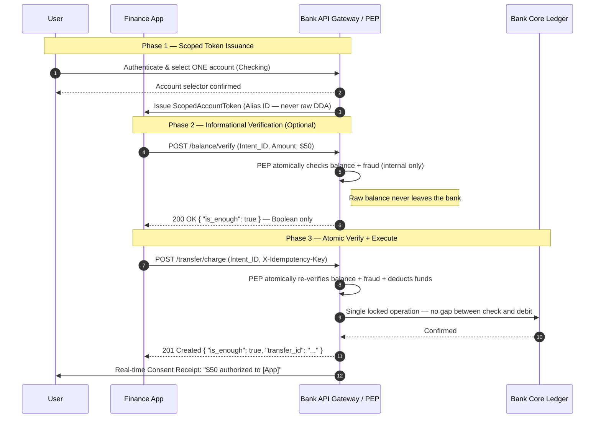
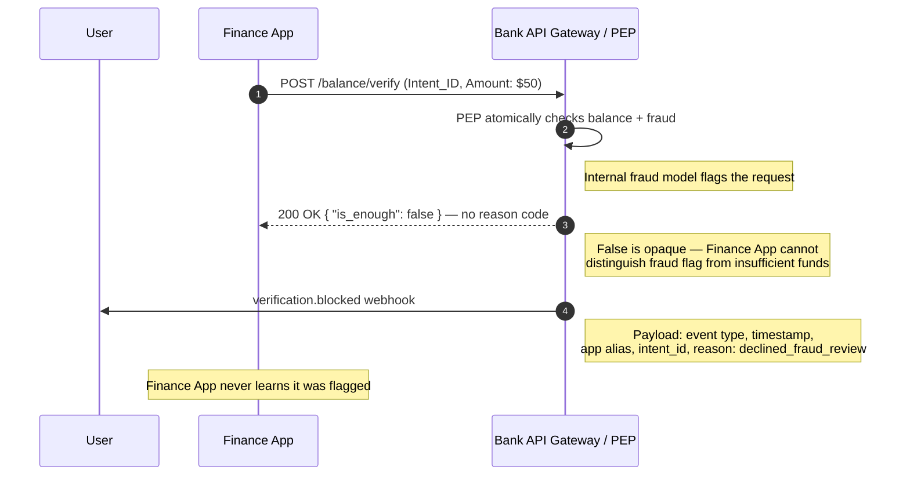
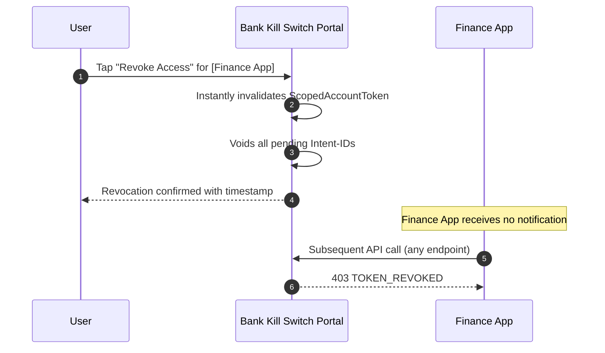
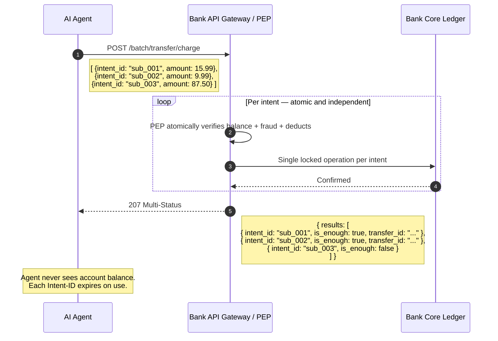

# LDBP Sequence Diagrams

Visual representations of key LDBP protocol flows.

---

## Diagram 1 — Standard Payment Flow (Phase 1)

The core LDBP transaction flow for a single payment.
`POST /transfer/charge` atomically re-verifies and executes
in one locked PEP operation — there is no separate execute step.

---

## Diagram 2 — Fraud Flag Flow

What happens when the bank's internal fraud model blocks a verification.
The Finance App receives only False — indistinguishable from
insufficient funds. The user is notified directly by the bank.

---

## Diagram 3 — Kill Switch Revocation

User revokes Finance App access instantly from the Connected Apps portal.
No Finance App involvement required. Takes effect in under one second.

---

## Diagram 4 — Agentic Batch Payment

An AI agent processing a queue of pre-authorized subscription payments
using `/batch/transfer/charge`. Each intent is atomically verified
and executed independently — no agent accumulates account state.

---

## Key Design Points Across All Flows

| Design Point | Where Visible |
|---|---|
| Raw DDA never transmitted to Finance App | Diagram 1 — token issuance shows Alias ID only |
| Composite atomic verification: balance + fraud | Diagrams 1, 2 — PEP note on every verify/charge call |
| False response is opaque — all failure modes identical | Diagram 2 — Finance App receives same False regardless |
| Notification sovereignty — bank notifies user directly | Diagrams 2, 3 — notifications go bank → user only |
| Kill Switch is instant and unilateral | Diagram 3 — no Finance App involvement |
| Agentic least-privilege — no accumulated state | Diagram 4 — each intent scoped, each ID expires on use |

---

*© 2026 Mary Ann Belarmino. BelarminoAdvisory.com. CC BY 4.0.*
